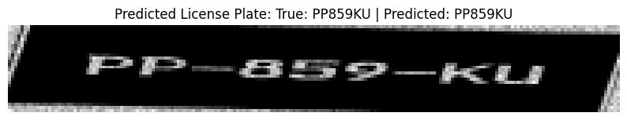
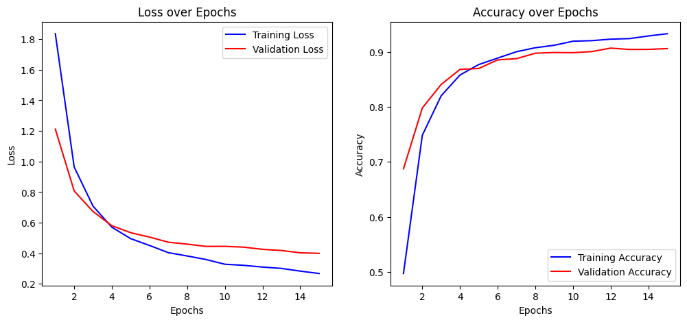
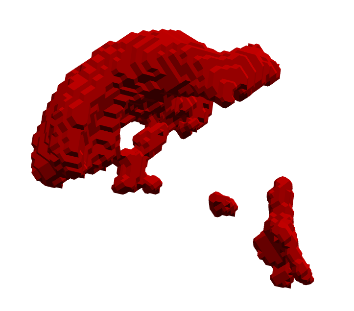
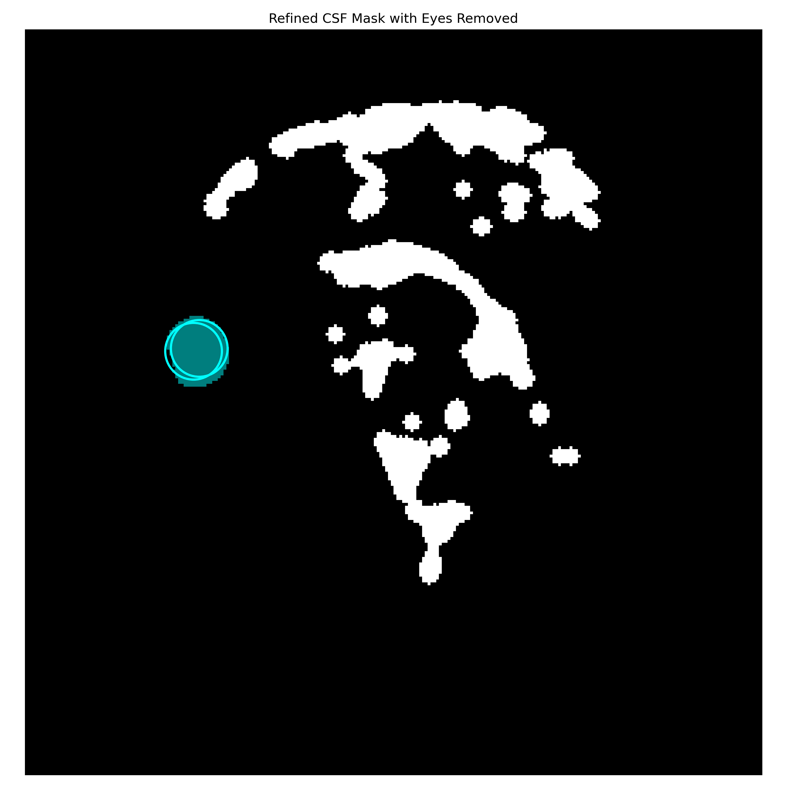
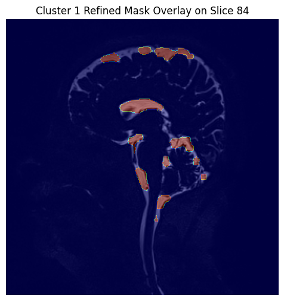

# TP-Python: Combined Projects Overview

Welcome to the **TP-Python** repository! This repository provides two comprehensive projects:

1. **License Plate Recognition Using Convolutional Neural Network (CNN)**
2. **MRI and CSF Mask Processing Pipeline**

Below you will find an overview of both projects along with instructions on installation, usage, and customization. The Jupyter notebooks were developed by Gabin, while the Python scripts were implemented by me.

## Table of Contents
- [License Plate Recognition Overview](#license-plate-recognition-overview)
- [MRI and CSF Mask Processing Pipeline Overview](#mri-and-csf-mask-processing-pipeline-overview)
- [Installation](#installation)
- [Usage](#usage)
- [Customization](#customization)
- [Contributing](#contributing)
- [License](#license)

## License Plate Recognition Overview
This project provides an end-to-end solution for training a CNN to recognize license plate characters. Key features include:

- **On-The-Fly Dataset Generation:** Create synthetic license plate images with various augmentations.
- **Customizable CNN Architecture:** Adapt the number of characters and output classes as required.
- **Training & Evaluation:** Scripts for pre-training with EMNIST, further training with synthetic data, and model evaluation.

### Example Results
The following images illustrate the results of the license plate recognition project:
- **License Plate Prediction:**  
    
- **Training Loss and Accuracy:**  
    

### Key Scripts
- **pre_train.py:** Initializes and trains the CNN using the EMNIST dataset.
- **train.py:** Trains the model with on-the-fly generated license plates featuring augmentations.
- **evaluate.py:** Evaluates the trained model on both synthetic and real license plates.

## MRI and CSF Mask Processing Pipeline Overview
This pipeline processes MRI data and CSF masks to enhance visualization and analysis. It includes:

- **Image Preprocessing:** Loads TIFF MRI data, applies Non-Local Means denoising, and normalizes intensities.
- **Feature Extraction & Clustering:** Computes neighborhood statistics (mean, variance) and segments MRI slices using MiniBatch K-Means.
- **Morphological Operations & Mesh Extraction:** Refines segmented masks and extracts optimized 3D meshes for visualization.
- **Interactive Visualization:** Provides interactive 3D visualizations of MRI volumes and refined CSF masks.

### Example Results
The following images demonstrate the outcomes of the MRI and CSF mask processing pipeline:
- **3D CSF Visualization:**  
    
- **Refined CSF Mask:**  
    
- **Slice 84 Cluster Overlay:**  
    

### Key Scripts
- **main.py:** Orchestrates the entire MRI processing pipeline.
- **utils.py:** Contains functions for image processing, clustering, morphological operations, and 3D mesh generation.
- **config.py:** Manages configuration settings, file paths, and parameters.

## Installation
1. **Clone the repository:**
     ```bash
     git clone https://github.com/H4ppyS1syphus/TP-Python.git
     cd TP-Python
     ```

2. **Create a Virtual Environment (Optional but Recommended):**
     ```bash
     python -m venv venv
     source venv/bin/activate  # On Windows: venv\Scripts\activate
     ```

3. **Install the Dependencies:**
     ```bash
     pip install -r requirements.txt
     ```

## Usage

### License Plate Recognition
Navigate to the corresponding folder and run the following scripts as needed:

- **Training the Model:**  
     ```bash
     python train.py
     ```

- **Evaluation:**  
     ```bash
     python evaluate.py
     ```

### MRI and CSF Mask Processing Pipeline
Navigate to the `IRM` folder and execute:
     ```bash
     python main.py
     ```

## Customization
- **License Plate Recognition:**  
    - Modify parameters in `dataset.py` (e.g., number of characters, augmentations).
    - Adjust the CNN architecture in `model.py` to improve accuracy.
    
- **MRI and CSF Mask Processing Pipeline:**  
    - Tweak preprocessing and clustering settings in `config.py` and `utils.py`.
    - Customize visualization options to suit your analysis needs.
